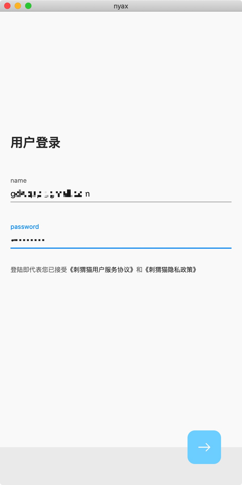
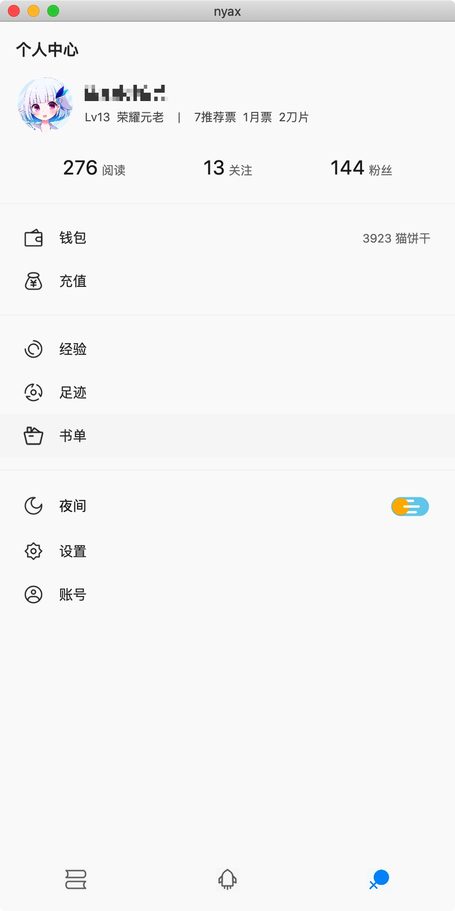
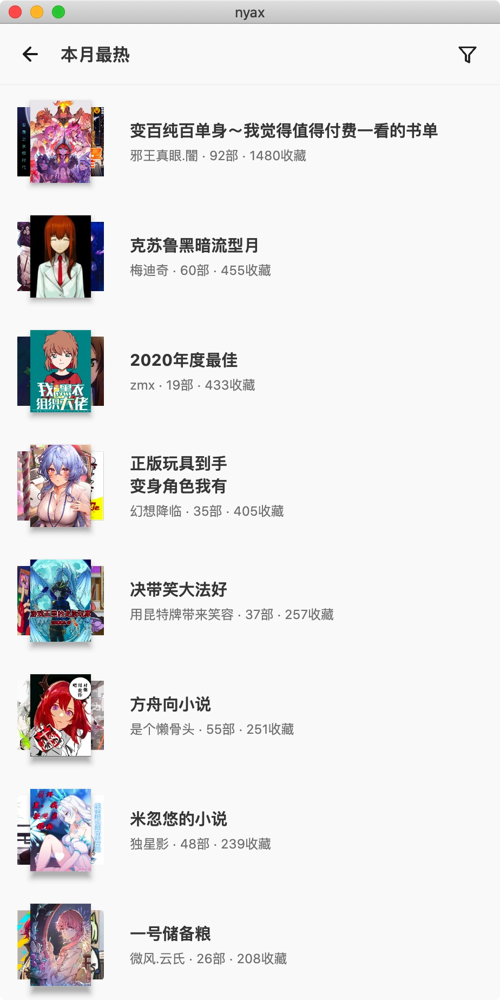
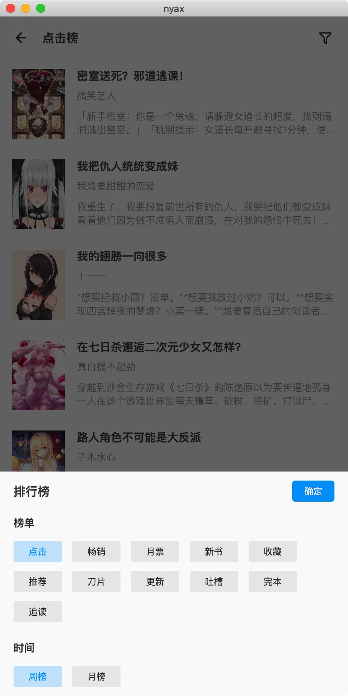
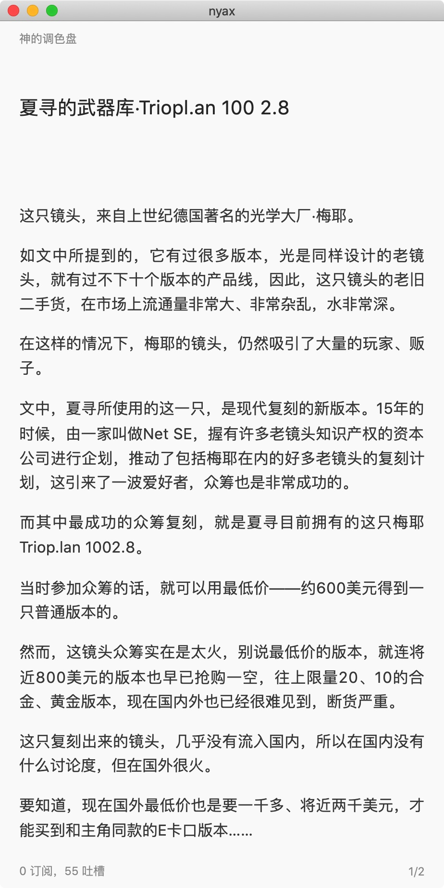
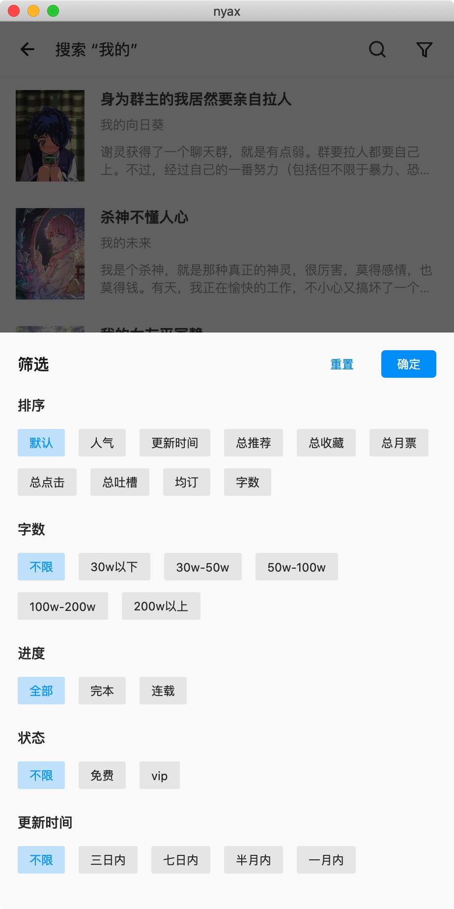
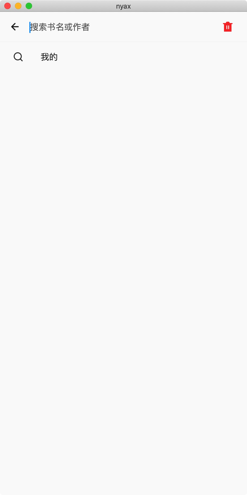

# nyax

使用 Flutter 开发的 `刺猬猫阅读` 第三方客户端

# features

- 使用官方 App 客户端 API，具有完整的功能，而非网页残疾接口。
- 支持用户登录，书架获取，书籍操作
- 支持排行榜获取，书单获取，以及详细的筛选功能
- 支持书籍搜索，以及相关的条件筛选

# screenshots

# to-do

- 书架切换
- 暗色模式
- 书籍阅读界面设置
- 书籍阅读界面排版
- ……

